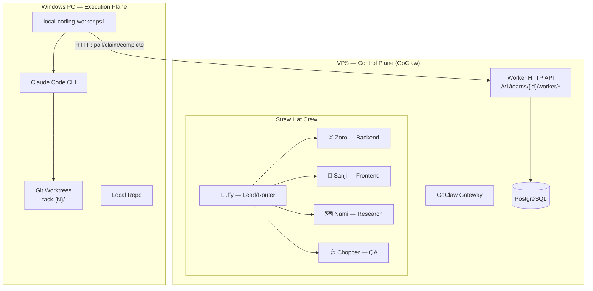

# 24 — Agent Team Setup Guide (Straw Hat Pirates)

This guide covers setting up a multi-agent team on GoClaw where VPS agents orchestrate work and an external Windows worker executes code locally via Claude Code.

---

## 1. Architecture Overview



### Key Principles

- **VPS agents do NOT edit product code** — they produce execution briefs
- **Windows worker executes via Claude Code** in git worktrees
- **Source code stays on Windows** — no repo mirror on VPS
- **Native team flow preserved** — task board, mailbox, blockers all work normally
- **One task at a time** for MVP

---

## 2. Prerequisites

- GoClaw deployed on VPS (Docker, v2.24.0+)
- PostgreSQL operational
- At least 1 LLM provider configured
- Windows 10/11 PC with:
  - PowerShell 7 (`pwsh`)
  - Claude Code CLI installed and authenticated
  - Git installed
  - Local repo checkout

---

## 3. One-Shot Setup

Run from the VPS host (same machine as Docker):

```bash
cd ~/services/goclaw
bash scripts/setup-strawhat-team.sh
```

This single command:
1. **Detects provider/model** from existing default agent
2. **Creates 5 predefined agents** (Luffy, Zoro, Sanji, Nami, Chopper)
3. **Activates agents** with provider/model
4. **Seeds role-specific IDENTITY.md** for each agent
5. **Creates team** "Straw Hat Pirates" (v2, active)
6. **Adds all 5 members** (Luffy=lead, rest=member)
7. **Verifies worker endpoints** are responding

### Management Commands

```bash
# Verify setup
bash scripts/setup-strawhat-team.sh --verify

# Tear down everything
bash scripts/setup-strawhat-team.sh --delete
```

The script is idempotent — safe to re-run. Existing resources are skipped.

### Environment Variables

| Variable | Required | Description |
|----------|----------|-------------|
| `GOCLAW_TOKEN` | Auto-detected from `.env` | Gateway token |
| `GOCLAW_URL` | Only for remote | VPS URL (not needed on VPS host) |
| `GOCLAW_MODEL` | No | Override model (default: detected from default agent) |

---

## 4. Agent Roles

| Agent | Key | Emoji | Responsibility |
|-------|-----|-------|---------------|
| **Luffy** | `luffy` | 🏴‍☠️ | Team lead, task router, progress tracker, failure handler |
| **Zoro** | `zoro` | ⚔️ | Backend debug + implementation briefs |
| **Sanji** | `sanji` | 🍳 | Frontend/UX implementation briefs |
| **Nami** | `nami` | 🗺️ | Research, specs (VPS workspace only, no code edits) |
| **Chopper** | `chopper` | 🩺 | QA, test verification, PASS/FAIL/TIMEOUT verdicts |

### Workflow Skills

Each agent has a matching skill in `skills/`:

| Skill | Agent | Purpose |
|-------|-------|---------|
| `strawhat-team-orchestration` | Luffy | Routing rules, circuit breaker, workflow templates |
| `strawhat-debug-workflow` | Zoro | Debug execution brief protocol |
| `strawhat-frontend-patterns` | Sanji | Frontend brief protocol |
| `strawhat-research-protocol` | Nami | Spec-only rules, dependency checks |
| `strawhat-test-checklist` | Chopper | Verification briefs, verdict format |

---

## 5. Worker HTTP API

8 REST endpoints under `/v1/teams/{teamId}/worker/`:

| Method | Path | Description |
|--------|------|-------------|
| `GET` | `/tasks?status=pending` | List claimable tasks |
| `GET` | `/tasks/{taskId}` | Get task detail |
| `POST` | `/tasks/{taskId}/claim` | Claim task (body: `{agent_id, worker_id}`) |
| `POST` | `/tasks/{taskId}/progress` | Progress + lock renewal (body: `{percent, step}`) |
| `POST` | `/tasks/{taskId}/comment` | Comment (body: `{content, agent_id}`) |
| `POST` | `/tasks/{taskId}/complete` | Complete (body: `{result, agent_id}`) |
| `POST` | `/tasks/{taskId}/fail` | Fail (body: `{reason, agent_id}`) |
| `POST` | `/heartbeat` | Liveness (body: `{worker_id, current_task_id}`) |

Auth: `Authorization: Bearer <api-key>` with at least operator scope.

Conflict responses (HTTP 409) for duplicate claim, complete-already-completed, fail-non-in-progress. Worker should treat 409 on complete as success (idempotent).

---

## 6. Windows Worker Setup

### Step 1: Create API Key

In GoClaw dashboard → API Keys → Create:
- Name: `worker-windows-01`
- Scopes: `operator.write`
- Save the key (shown once)

### Step 2: Create Config

`$env:USERPROFILE\.goclaw-worker\config.json`:

```json
{
  "vps_url": "https://your-goclaw-domain.com",
  "team_id": "<team-uuid-from-setup-output>",
  "worker_id": "windows-pc-01",
  "repo_key": "goclaw",
  "repo_path": "D:\\WORKSPACES\\PERSONAL\\goclaw",
  "worktree_base": "D:\\WORKSPACES\\PERSONAL\\goclaw-worktrees",
  "poll_interval_seconds": 10,
  "stale_worktree_ttl_hours": 24,
  "allowed_job_types": ["implement", "debug", "test", "review"],
  "heartbeat_interval_seconds": 30,
  "max_task_runtime_seconds": {
    "implement": 1800,
    "debug": 900,
    "test": 900,
    "review": 600
  },
  "min_disk_free_gb": 1,
  "max_brief_bytes": 51200
}
```

### Step 3: Set API Key

```powershell
$env:GOCLAW_WORKER_API_KEY = "gk_your_api_key_here"
```

Or persist in PowerShell profile / Windows environment.

### Step 4: Run Worker

```powershell
pwsh -NoProfile -ExecutionPolicy Bypass -File .\scripts\local-coding-worker.ps1
```

Worker will:
1. Validate prerequisites (claude, git, disk space)
2. Clean stale worktrees
3. Start heartbeat (every 30s)
4. Poll for pending tasks (every 10s)
5. On task found: validate → claim → worktree → Claude Code → result → cleanup

---

## 7. Worker Lifecycle

```
poll GET /worker/tasks?status=pending
  └→ task found
       ├→ validate (repo, job_type, brief size, disk space)
       ├→ POST /claim {agent_id, worker_id}
       ├→ git worktree add goclaw-worktrees/task-{N} -b task/{N}
       ├→ POST /progress {25%, "launching claude"}
       ├→ claude --print --dangerously-skip-permissions --prompt-file brief.md
       │    └→ heartbeat every 30s (POST /heartbeat + /progress)
       │    └→ timeout enforcement per job_type
       ├→ POST /progress {75%, "collecting results"}
       ├→ POST /complete or /fail (with retry + idempotent 409 handling)
       └→ git worktree remove + branch delete (retry with backoff)
```

### Git Worktree Naming

- Worktree path: `goclaw-worktrees/task-{N}/`
- Branch: `task/{N}`
- Main checkout never edited by worker
- Stale worktrees cleaned on startup (older than `stale_worktree_ttl_hours`)

### Trusted-Task Validation

Before executing, worker validates:
1. `repo_path` matches config (case-insensitive on Windows)
2. `job_type` in allowed list
3. `brief_markdown` non-empty and < `max_brief_bytes`
4. Disk space >= `min_disk_free_gb`

Rejected tasks are auto-failed with reason.

---

## 8. Failure Recovery

### 3-Strike Circuit Breaker
- Fail 1 → auto-retry with refined brief
- Fail 2 → auto-retry with escalation note
- Fail 3 → stop, mark blocked, require lead manual review

### Worker Offline Protocol
- Heartbeat missed 2 intervals → VPS marks worker offline
- Active task → mark stale, lead reassigns
- Worker must NOT re-claim reassigned tasks on reconnect

### Timeout Budgets

| Job Type | Timeout | Use Case |
|----------|---------|----------|
| `implement` | 1800s (30 min) | New features, refactors |
| `debug` | 900s (15 min) | Bug fixes |
| `test` | 900s (15 min) | Test execution |
| `review` | 600s (10 min) | Code review |

### Blocker Taxonomy

| Type | Meaning |
|------|---------|
| `technical` | Code error, build failure |
| `user_response` | Waiting on user input |
| `worker_offline` | Worker unreachable |
| `timeout` | Worker timed out |
| `dependency` | Blocked by another task |

---

## 9. Operational Runbook

### Start Worker
```powershell
$env:GOCLAW_WORKER_API_KEY = "gk_..."
pwsh -NoProfile -ExecutionPolicy Bypass -File .\scripts\local-coding-worker.ps1
```

### Kill Orphan Claude Processes
```powershell
Get-Process claude -ErrorAction SilentlyContinue | Stop-Process -Force
```

### Recover Stuck Worktrees
```powershell
git worktree list
git worktree prune
Get-ChildItem D:\WORKSPACES\PERSONAL\goclaw-worktrees\ | Remove-Item -Recurse -Force
```

### Rotate Worker Credentials
1. Create new API key in dashboard
2. Update `$env:GOCLAW_WORKER_API_KEY`
3. Revoke old key in dashboard

### Verify Setup
```bash
# On VPS
bash scripts/setup-strawhat-team.sh --verify
```

---

## 10. Security

- Worker auth uses operator-scoped API key (not admin)
- `brief_markdown` passed via temp file, not shell argument (prevents injection)
- Environment stripped before Claude launch (PATH + HOME + TEMP only)
- Hard timeout per job type with process-tree kill
- Git worktree isolation — main checkout never touched
- No arbitrary shell passthrough from task metadata
- Outbound-only connections (PC → VPS, never VPS → PC)

---

## File Reference

| File | Purpose |
|------|---------|
| `internal/http/team_worker.go` | 8 HTTP REST endpoints for worker |
| `internal/http/team_worker_test.go` | 17 unit tests |
| `internal/gateway/server.go` | `SetTeamWorkerHandler` registration |
| `cmd/gateway_http_handlers.go` | Handler instantiation |
| `cmd/gateway.go` | Handler wiring |
| `scripts/setup-strawhat-team.sh` | One-shot team bootstrap (idempotent) |
| `scripts/local-coding-worker.ps1` | PowerShell worker for Windows |
| `skills/strawhat-team-orchestration/` | Luffy orchestration skill |
| `skills/strawhat-debug-workflow/` | Zoro debug skill |
| `skills/strawhat-frontend-patterns/` | Sanji frontend skill |
| `skills/strawhat-research-protocol/` | Nami research skill |
| `skills/strawhat-test-checklist/` | Chopper QA skill |

---

## Cross-References

| Document | Relevant Content |
|----------|-----------------|
| [11-agent-teams.md](./11-agent-teams.md) | Core team system, task board, mailbox |
| [18-http-api.md](./18-http-api.md) | Worker HTTP endpoints reference |
| [20-api-keys-auth.md](./20-api-keys-auth.md) | API key scopes for worker auth |
| [09-security.md](./09-security.md) | Security model |
